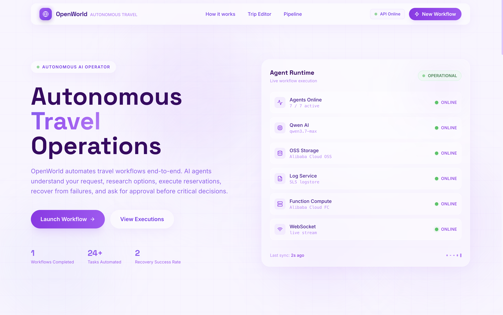

# OpenWorld — Autonomous AI Workflow Execution

> **8 AI agents. Zero manual steps. Real decisions. End-to-end autonomous execution.**

> 🏁 **Submitted to: [Global AI Hackathon Series with Qwen Cloud](https://qwencloud-hackathon.devpost.com/) — Track 4: Autopilot Agent**

OpenWorld is a production-ready autonomous workflow execution system powered by **Qwen AI (Alibaba Cloud)**. Define a workflow policy in `trip.md` — a pipeline of specialized AI agents handles planning, search, budget enforcement, reservations, failure recovery, and report generation — end to end, without human intervention except at critical approval gates.

[](./LICENSE)
[](https://dashscope-intl.aliyuncs.com)
[](https://www.alibabacloud.com)

---

## Live Demo

[](https://youtu.be/p7wIblj8hJg)

| | |
|---|---|
| **Frontend** | [openworld-alpha.vercel.app](https://openworld-alpha.vercel.app) |
| **API** | `https://qwenhack-rdypqsjofu.us-west-1.fcapp.run/health` |
| **Track** | Track 4 — Autopilot Agent |

---

## Why OpenWorld?

Unlike traditional AI travel planners that generate suggestions, OpenWorld **executes complete workflows autonomously**.

- Understands ambiguous travel requests expressed as YAML policy
- Invokes external APIs (flights, hotels, maps) and synthesises results with Qwen AI
- Requests human approval before committing critical spend
- Recovers automatically from failures with Qwen-powered replanning
- Persists session memory and streams all activity logs to Alibaba SLS in real time

The reader should understand within the first minute: **OpenWorld is an autonomous AI workflow system that happens to automate travel**.

---

## Screenshots

| | |
|---|---|
| **Landing Page** | Agent showcase + hero section |
| **Workflow Policy Editor** | Monaco editor with `trip.md` syntax, live run button |
| **Agent Pipeline** | Real-time animated node graph showing each agent state |
| **Live Workflow Execution** | Activity feed streaming structured logs per agent |
| **Final Report** | AI-generated Markdown report with cost tables and itinerary |

> See the [demo video](https://youtu.be/A2_0xyCH6Ls) for a live walkthrough of all five screens.

---

## Features

| Feature | Status |
|---------|--------|
| Multi-Agent Orchestration | ✅ |
| Human Approval Gate | ✅ |
| Failure Recovery | ✅ |
| Persistent Memory | ✅ |
| Live Execution Graph | ✅ |
| Real Flight & Hotel Search | ✅ |
| Qwen AI Reasoning | ✅ |
| Alibaba Cloud Deployment | ✅ |

---

## Alibaba Cloud Services

| Service | Usage | Code Reference |
|---|---|---|
| **Qwen AI** (`qwen3.7-max`) | Powers all agents — planning, search synthesis, recovery, report generation | [`src/og_compute.rs`](./backend/src/og_compute.rs) |
| **OSS** (Object Storage) | Stores final Markdown workflow reports per session | [`src/agents/artifact.rs`](./backend/src/agents/artifact.rs) |
| **SLS** (Log Service) | Streams all agent activity logs to cloud logstore in real time | [`src/orchestrator.rs`](./backend/src/orchestrator.rs) |
| **Function Compute** | Hosts the Rust API as a serverless `linux/amd64` container | [`Dockerfile`](./backend/Dockerfile) |

---

## System Architecture

```
┌─────────────────────────────────────────────────────────────────┐
│                     FRONTEND (React + Vite)                     │
│  Policy Editor (Monaco) → useSession hook → REST polling 1.5s   │
│  PipelineGraph · ActivityFeed · ApprovalGate · WorkflowResult   │
└───────────────────────────┬─────────────────────────────────────┘
                            │ HTTPS
                            ▼
┌────────────────────────────────────────────────────────────────┐
│           BACKEND — Rust / Axum (Alibaba Function Compute)     │
│                                                                │
│  ┌────────┐  ┌────────┐  ┌──────────┐  ┌────────────────────┐  │
│  │ Intent │→ │Planner │→ │  Search  │→ │   Reservation      │  │
│  └────────┘  └────────┘  └──────────┘  └─────────┬──────────┘  │
│                                                  │             │
│  ┌────────┐  ┌──────────┐  ┌──────────┐          │             │
│  │ Report │← │ Recovery │← │ Approval │←─────────┘             │
│  │ Agent  │  │  Agent   │  │  Agent   │  ← human gate          │
│  └────┬───┘  └──────────┘  └──────────┘                        │
│       │                                                        │
└───────┼────────────────────────────────────────────────────────┘
        │                    │                    │
        ▼                    ▼                    ▼
┌─────────────┐    ┌──────────────────┐  ┌─────────────────────┐
│  Qwen AI    │    │   Alibaba OSS    │  │   Alibaba SLS       │
│ qwen3.7-max │    │ (report storage) │  │  (activity logs)    │
└─────────────┘    └──────────────────┘  └─────────────────────┘
```

---

## Agent Pipeline

| Step | Agent | Role |
|---|---|---|
| 00 | **System** | Initialises session, loads workflow policy, validates constraints |
| 01 | **Intent** | Parses `trip.md` YAML into structured machine-executable constraints |
| 02 | **Planner** | Generates a day-by-day itinerary using Qwen AI reasoning |
| 03 | **Search** | Finds real flights, hotels, and transport via SerpAPI + Mapbox |
| 04 | **Approval** | Enforces budget policy — pauses workflow for human approval if threshold exceeded |
| 05 | **Reservation** | Selects optimal options and confirms bookings |
| 06 | **Recovery** | Auto-retries failed bookings with Qwen-powered alternative strategies |
| 07 | **Memory** | Persists session context and agent state across the full pipeline |
| 08 | **Report** | Generates Markdown report, uploads to Alibaba OSS, signs with HMAC proof |

Session state machine: `created → planning → searching → verifying_budget → awaiting_approval → reserving → recovering → finalising → complete`

---

## External Tools

| Tool | Purpose |
|------|---------|
| Qwen AI (`qwen3.7-max`) | Agent reasoning, ranking, replanning, report writing |
| SerpAPI | Real flight and hotel search |
| Mapbox | Location data and mapping |
| Alibaba OSS | Workflow report storage |
| Alibaba SLS | Real-time activity log streaming |
| Alibaba FC | Serverless container execution |

---

## API Usage by Agent

Each agent calls a specific combination of APIs. No agent is a black box — every external call is typed and auditable.

| Agent | Qwen AI | SerpAPI | Mapbox | OSS | SLS |
|---|:---:|:---:|:---:|:---:|:---:|
| Intent | — | — | — | — | ✅ |
| Planner | ✅ `infer()` | — | — | — | ✅ |
| Search | ✅ `think_then_answer()` | ✅ Flights + Hotels | ✅ Geocoding | — | ✅ |
| Approval | — | — | — | — | ✅ |
| Reservation | ✅ `infer()` | — | — | — | ✅ |
| Recovery | ✅ `infer()` re-prompt | — | — | — | ✅ |
| Memory | — | — | — | — | ✅ |
| Report | ✅ `infer()` | — | — | ✅ Upload | ✅ |

### Qwen API — How It's Called

OpenWorld uses Qwen's **OpenAI-compatible** endpoint with two calling patterns:

**1. Single-turn inference** (`infer`) — used by Planner, Reservation, Recovery, Report:
```rust
// qwen_client.rs — system prompt is fixed across all agents
pub async fn infer(&self, prompt: &str) -> Result<String> {
    self.infer_with_system(
        "You are an autonomous travel planning agent. \
         Output structured JSON when asked. Be concise and deterministic.",
        prompt,
        Some(4096),
    ).await
}
// → POST https://dashscope-intl.aliyuncs.com/compatible-mode/v1/chat/completions
//   { model: "qwen3.7-max", messages: [...], max_tokens: 4096, enable_thinking: false }
```

**2. Two-turn ReAct-style reasoning** (`think_then_answer`) — used by SearchAgent:
```rust
// Turn 1: model reasons freely about flight/hotel options (scratchpad, 512 tokens)
// Turn 2: model's own reasoning fed back as context → outputs final ranked JSON
pub async fn think_then_answer(&self, system, think_prompt, answer_prompt, max_tokens)
```
This produces higher-quality ranked results than a single-turn call — the model reasons before committing to specific flights and prices.

### SerpAPI — Real Inventory, Not Hallucinated Prices

```
GET https://serpapi.com/search.json
  ?engine=google_flights
  &departure_id=BKK
  &arrival_id=TYO
  &outbound_date=2026-08-01
  &return_date=2026-08-06
  &currency=USD

GET https://serpapi.com/search.json
  ?engine=google_hotels
  &q=hotels+in+Tokyo
  &check_in_date=2026-08-01
  &check_out_date=2026-08-06
  &min_price=0&max_price=120
```

Raw results are passed to Qwen's `think_then_answer` for ranking and selection — replacing hallucinated prices with real inventory.

---


## Problems We Solve

### 1. Multi-Step Workflows Require Manual Coordination

Executing an international trip requires 4–8 hours of manual work across 6+ platforms. Each step is disconnected, error-prone, and requires human judgment at every stage.

With OpenWorld: a single `trip.md` policy file replaces all input. AI agents execute each step, hand off typed outputs, and enforce constraints automatically.

### 2. AI Systems Have No Recovery From Failure

When a booking fails, traditional systems stop and report an error. Users restart from scratch.

With OpenWorld: `RecoveryAgent` detects every failure, re-prompts Qwen with failure context, and generates a fundamentally different strategy — different airline, hotel tier, or route — without user intervention.

### 3. Autonomous Systems Cannot Be Trusted With Critical Spend

AI systems that commit real spend without human oversight are a fundamental trust and adoption barrier.

With OpenWorld: `ApprovalAgent` pauses the pipeline via a `tokio::sync::oneshot` channel before any reservation is committed. The frontend renders a full budget breakdown. A single human click resumes or cancels the workflow.

### 4. No Visibility Into What the AI Is Doing

Most AI workflow tools are black boxes — you submit a request and wait.

With OpenWorld: every agent emits structured logs streamed to the frontend in real time. `PipelineGraph` shows exactly which agent is running, completed, or failed, derived from live log analysis.

---

## Implementation Highlights

### Qwen Multi-Agent Prompting

Each agent uses a domain-specific Qwen prompt strategy — not a single prompt:

```rust
// PlannerAgent — structured JSON itinerary from YAML policy
let prompt = format!(
    "You are a travel planner. Given this policy:\n{}\n\
     Generate a structured day-by-day itinerary as JSON with: \
     days[], each with activities[], estimated_cost_usd, and notes.",
    serde_yaml::to_string(&session.policy)?
);

// RecoveryAgent — re-prompts with failure context for a different strategy
let recovery_prompt = format!(
    "Previous booking attempt failed: {}\n\
     Original plan: {}\n\
     Suggest a completely different approach — \
     different airline, hotel tier, or route.",
    failure_reason, original_plan
);
```

### Human-in-the-Loop Approval Gate

The pipeline pauses mid-execution using a `oneshot` channel — not polling:

```rust
// ApprovalAgent pauses the pipeline
let (tx, rx) = tokio::sync::oneshot::channel::<bool>();
session.set_approval_channel(tx).await;
session.set_state(SessionState::AwaitingApproval).await;

let approved = rx.await.unwrap_or(false);
if !approved {
    session.set_state(SessionState::Failed).await;
    return Err(anyhow!("Workflow rejected by operator"));
}
```

```rust
// POST /sessions/:id/approve — resumes pipeline
async fn approve_handler(...) {
    session.approve(true).await;  // sends through oneshot, pipeline continues
}
```

### Async Rust Orchestration

The full pipeline runs as a `tokio::spawn` task with `broadcast` channels for real-time log streaming to multiple subscribers simultaneously:

```rust
run_session(session.clone());  // non-blocking, fires and polls via GET /sessions/:id/logs
```

---

## Why OpenWorld Is Different

OpenWorld treats **AI agents as stateful typed pipeline stages**, not one-shot chatbots:

- Each agent receives structured context (policy + previous agent outputs) and produces typed Rust structs consumed by the next stage — a **typed AI pipeline**
- The **Intent Agent** separates intent parsing from execution — downstream agents never parse free text
- The **ApprovalAgent** is a first-class architectural primitive, not a UI workaround — a mid-pipeline channel pause with full budget context surfaced to the decision UI
- The **PipelineGraph** frontend component derives each node's state from live log stream analysis rather than explicit state events — resilient to partial failures
- All logs are persisted to **Alibaba SLS** — every workflow execution is fully auditable

---

## Workflow Policy

Define your workflow as code in `trip.md`:

```yaml
trip:
  origin: BKK                    # IATA departure code
  destination: TYO               # IATA destination
  departure_date: "2026-08-01"
  return_date:    "2026-08-06"
  budget_max: "1500 USD"

flight:
  max_stops: 1
  avoid_red_eye: true
  preferred_airlines: [ANA, JAL]

hotel:
  min_rating: 4.0
  max_price_per_night: "120 USD"
  near_station: true

vault:
  auto_payment: true
  max_single_transaction: "800 USD"  # triggers ApprovalAgent gate if exceeded
```

---

## Project Structure

```
openworld/
├── backend/                    # Rust orchestration engine + API server
│   ├── src/
│   │   ├── agents/
│   │   │   ├── planner.rs      # Qwen itinerary generation
│   │   │   ├── search.rs       # SerpAPI + Qwen ranking
│   │   │   ├── reservation.rs  # Booking selection + confirmation
│   │   │   ├── vault.rs        # Budget enforcement + approval gate
│   │   │   ├── recovery.rs     # Failure detection + Qwen replanning
│   │   │   └── artifact.rs     # OSS upload + HMAC proof signing
│   │   ├── api.rs              # Axum HTTP + WebSocket server
│   │   ├── og_compute.rs       # Qwen AI client
│   │   ├── og_storage.rs       # Alibaba OSS client
│   │   ├── orchestrator.rs     # Session state machine + SLS logging
│   │   └── travel_spec.rs      # Workflow policy YAML parser
│   ├── Dockerfile              # linux/amd64 for Alibaba FC
│   └── examples/trip.md        # Example workflow policy
├── frontend/                   # React 18 + TypeScript + Vite
│   └── src/
│       ├── hooks/useSession.ts     # API polling + state management
│       └── components/
│           ├── PipelineGraph.tsx   # Live agent pipeline visualisation
│           ├── AgentShowcase.tsx   # 9-agent showcase section
│           ├── ApprovalGate.tsx    # Human-in-the-loop decision UI
│           ├── TripResult.tsx      # AI report renderer (react-markdown)
│           ├── ActivityFeed.tsx    # Real-time log stream
│           └── TripEditor.tsx      # Monaco editor for workflow policy
└── README.md
```

---

## Local Development

```bash
# Backend
cd backend
cp .env.example .env        # fill in API keys
cargo run --bin api          # http://localhost:3000

# Frontend
cd frontend
pnpm install
echo "VITE_API_URL=http://localhost:3000" > .env.local
pnpm dev                     # http://localhost:5173

# CLI — run a workflow without the frontend
cd backend
cargo run --bin travel -- examples/trip.md
```

---

## Environment Variables

| Variable | Description |
|---|---|
| `QWEN_API_KEY` | Alibaba Cloud Model Studio API key |
| `QWEN_ENDPOINT` | Qwen chat completions URL |
| `QWEN_MODEL` | Model name (e.g. `qwen3.7-max`) |
| `SERPAPI_KEY` | SerpAPI key for flight/hotel search |
| `MAPBOX_ACCESS_TOKEN` | Mapbox token for location data |
| `OSS_ACCESS_KEY_ID` | Alibaba Cloud OSS access key |
| `OSS_ACCESS_KEY_SECRET` | Alibaba Cloud OSS secret |
| `OSS_BUCKET` | OSS bucket name |
| `OSS_ENDPOINT` | OSS regional endpoint |
| `SLS_ACCESS_KEY_ID` | Alibaba SLS access key |
| `SLS_ACCESS_KEY_SECRET` | Alibaba SLS secret |
| `SLS_ENDPOINT` | SLS endpoint |
| `SLS_PROJECT` | SLS project name |
| `SLS_LOGSTORE` | SLS logstore name |

---

## Deployment

```bash
# Build + push to Docker Hub
cd backend
docker buildx build --platform linux/amd64 \
  -t jfkongphop/openworld-api:latest --push .

# Redeploy: Alibaba FC Console → Edit Function → Deploy
```

FC settings: Custom Container · Startup `./api` · Port `3000` · Timeout `300s`

---

## License

MIT © 2026 OpenWorld — see [LICENSE](./LICENSE)

Built an autonomous AI travel agent in Rust + Qwen AI.

Write a trip.md policy → 9 AI agents handle everything:
planning → flight search → budget gate → booking → failure recovery → report

Human only clicks once: approve or reject before spend commits.

Deployed on Alibaba Function Compute. Real flights. Real hotels. Real decisions.

🔗 openworld-alpha.vercel.app

#QwenAI #AlibabaCloud #AIAgents #Rust #Hackathon